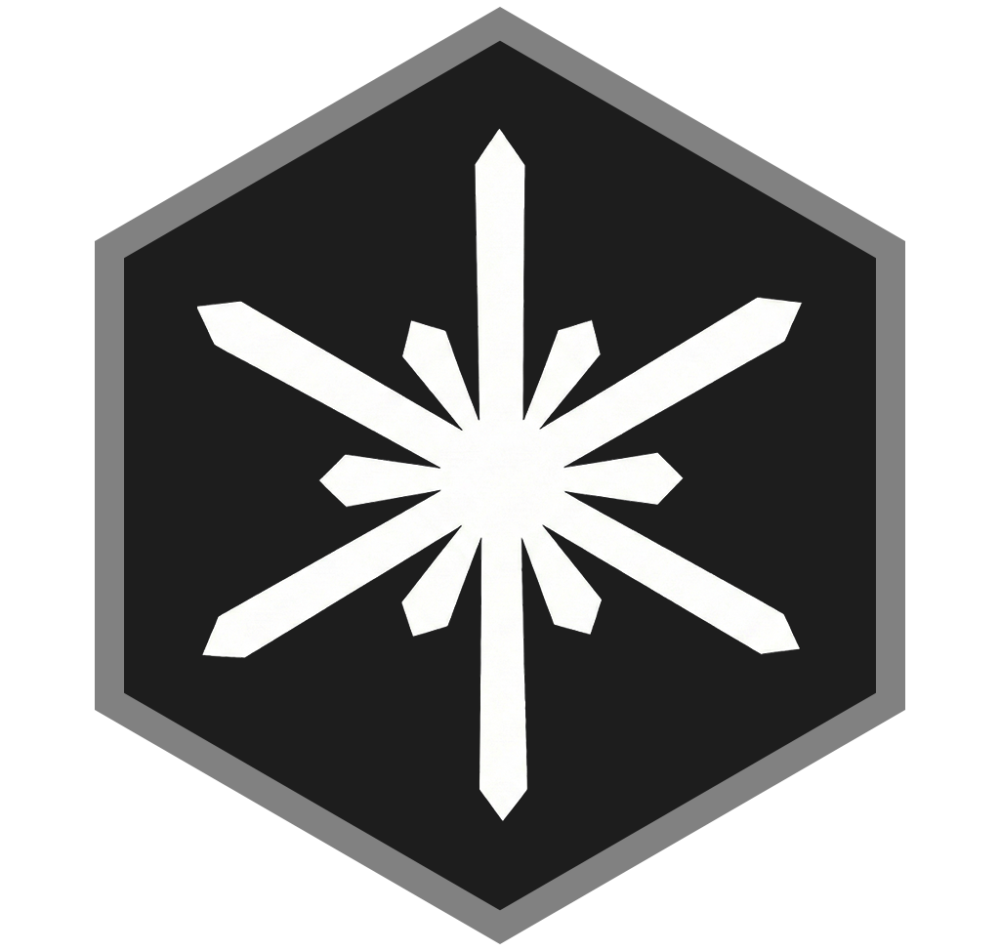
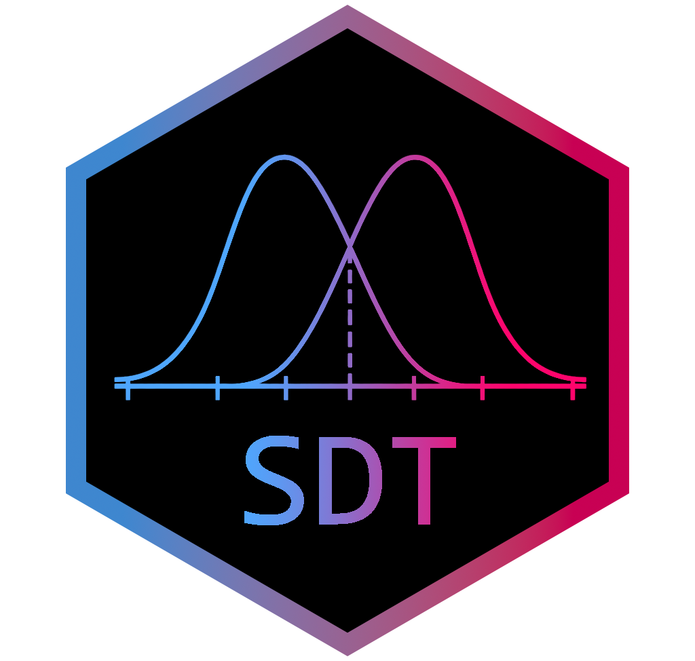
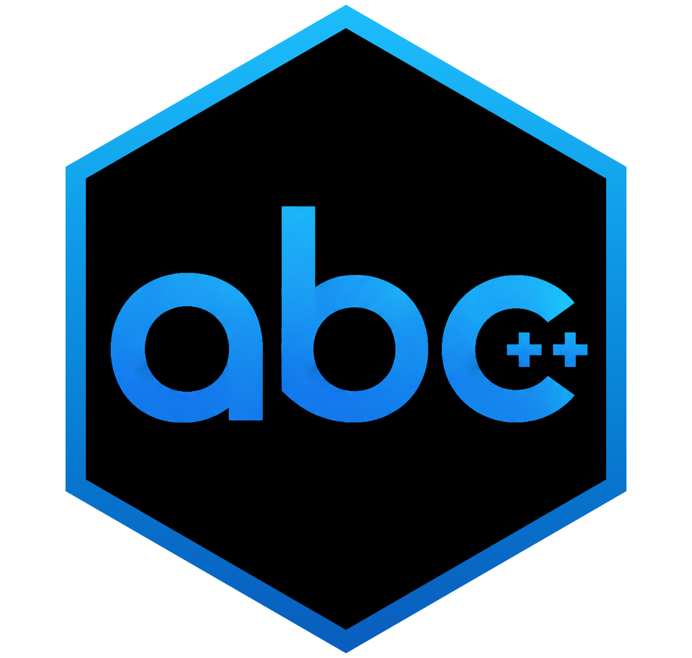
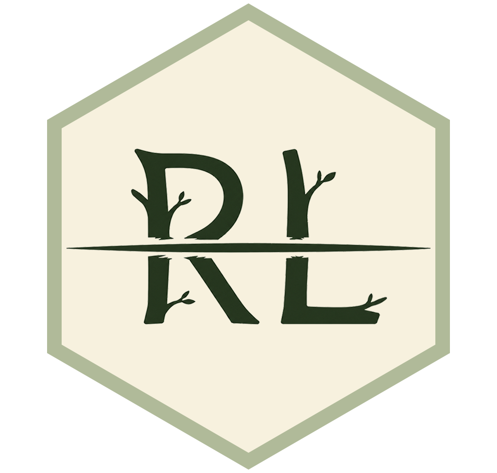

  
  
  
  
  

<h1 align="center">Evericonts</h1>

<table>
<tr>
<td align="center">
<picture>
<source media="(prefers-color-scheme: dark)"
srcset="https://github-readme-stats-gamma-beryl-27.vercel.app/api?theme=onedark&bg_color=0d1117&hide_border=true&title_color=5991f1&text_color=ffffff&icon_color=5991f1&username=yuki-961004&show_icons=true&include_all_commits=true&count_private=true&show=reviews%2Cdiscussions_answered&rank_icon=percentile&role=OWNER%2CORGANIZATION_MEMBER%2CCOLLABORATOR">

</picture>
</td>

<td width="10"></td>

<td align="center">
<picture>
<source media="(prefers-color-scheme: dark)"
srcset="https://github-readme-stats-gamma-beryl-27.vercel.app/api/top-langs/?theme=onedark&bg_color=0d1117&hide_border=true&title_color=5991f1&text_color=ffffff&username=yuki-961004&count_private=true&layout=compact&exclude_repo=Hardware-Course&hide=HTML%2CJupyter%20Notebook%2CMATLAB&role=OWNER%2CORGANIZATION_MEMBER%2CCOLLABORATOR&langs_count=12">

</picture>
</td>
</tr>
</table>

