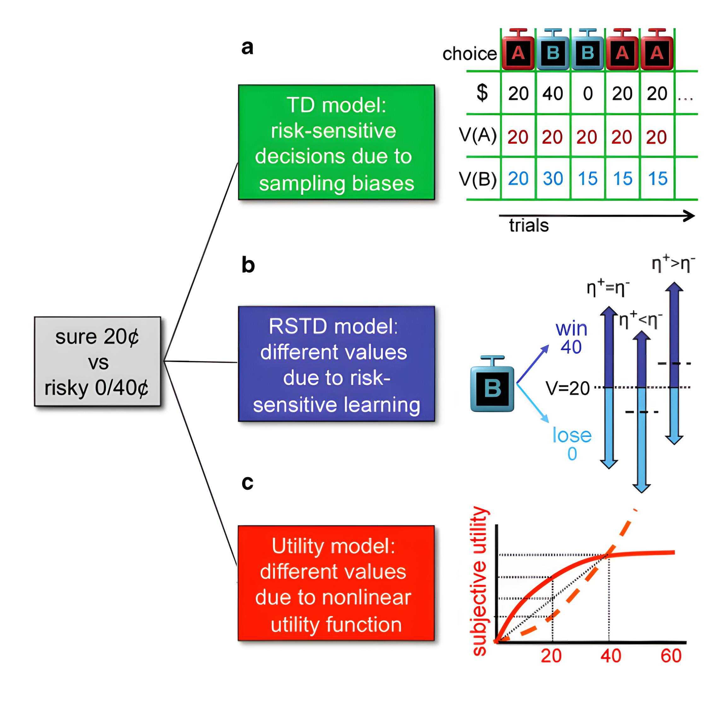

<a href="https://yuki-961004.github.io/binaryRL/"></a>

<!-- badges: start -->

<style>
  .badges a {
    text-decoration: none !important;
    box-shadow: none !important; /* 有些主题（如 Academic）使用 box-shadow 代替下划线 */
  }
</style>

<div class="badges" style="text-decoration: none;">
  <a href="https://github.com/yuki-961004/binaryRL/actions/workflows/R-CMD-check.yaml"> 
     
  </a><a href="https://app.codecov.io/gh/yuki-961004/binaryRL"> 
     
  </a><a href="https://CRAN.R-project.org/package=binaryRL"> 
     
  </a><a href="https://CRAN.R-project.org/package=binaryRL"> 
    
  </a>
</div>

<!-- badges: end -->

## Overview

This package is designed to help users build the **Rescorla-Wagner Model** for **Two-Alternative Forced Choice** tasks (for multi-armed bandit see [multiRL](https://yuki-961004.github.io/multiRL/)). Beginners can define models using simple **`if-else`** logic, making model construction more accessible.

- [Step 1](https://yuki-961004.github.io/binaryRL/articles/binaryRL.html#id_1-run-model): Build Reinforcement Learning Models `run_m()`
- [Step 2](https://yuki-961004.github.io/binaryRL/articles/binaryRL.html#id_2-recovery): Parameter and Model Recovery `rcv_d()`
- [Step 3](https://yuki-961004.github.io/binaryRL/articles/binaryRL.html#id_3-fit-real-data): Fit Real Data `fit_p()`
- [Step 4](https://yuki-961004.github.io/binaryRL/articles/binaryRL.html#id_4-replay-the-experiment): Replay the Experiment `rpl_e()`

<!---------------------------------------------------------->

## Installation

``` r
# Install the stable version from CRAN  
install.packages("binaryRL")
# Install the latest version from GitHub
remotes::install_github("yuki-961004/binaryRL@*release")

# Load package
library(binaryRL)
# Obtain help document
?binaryRL
```

```{=html}
<pre>
                                      ╔═════════════════════════╗
                                      ║ ╔----------╗            ║
                                      ║ | ██████╗  |  ██╗       ║
 |     _)                             ║ | ██╔══██╗ |  ██║       ║
 __ \   |  __ \    _` |   __|  |   |  ║ | ██████╔╝ |  ██║       ║
 |   |  |  |   |  (   |  |     |   |  ║ | ██╔══██╗ |  ██║       ║
_.__/  _| _|  _| \__,_| _|    \__, |  ║ | ██║  ██║ |  ███████╗  ║
                              ____/   ║ | ╚═╝  ╚═╝ |  ╚══════╝  ║
                                      ║ ╚----------╝            ║
                                      ╚═════════════════════════╝
</pre>
```

<!---------------------------------------------------------->

# Tutorial

*In tasks with small, finite state sets (e.g. TAFC tasks in psychology), all states, actions, and their corresponding rewards can be recorded in tables.*

- Sutton & Barto [(2018)](https://mitpress.mit.edu/9780262039246/reinforcement-learning/) term this kind of scenario as the **tabular case** and the corresponding methods as **tabular methods**.\
- The development and usage workflow of this R package follows to the **four** stages (ten rules) recommended by Wilson & Collins [(2019)](https://doi.org/10.7554/eLife.49547).\
- The **three** basic models built into this R package are referenced from Niv et al. [(2012)](https://doi.org/10.1523/JNEUROSCI.5498-10.2012).\
- The **example data** used in this R package is an open data from Mason et. al. [(2024)](https://osf.io/hy3q4/)

<p align="center">

 

</p>

<!---------------------------------------------------------->

## [Example Data](https://yuki-961004.github.io/binaryRL/demo/DATA/binaryRL_data.html)

``` r
head(binaryRL::Mason_2024_G2)
```

| Subject | Block | Trial | L_choice | R_choice | L_reward | R_reward | Sub_Choose | \-  |
|---------|-------|-------|----------|----------|----------|----------|------------|-----|
| 1       | 1     | 1     | A        | B        | 36       | 40       | A          | ... |
| 1       | 1     | 2     | B        | A        | 0        | 36       | B          | ... |
| 1       | 1     | 3     | C        | D        | -36      | -40      | C          | ... |
| 1       | 1     | 4     | D        | C        | 0        | -36      | D          | ... |
| ...     | ...   | ...   | ...      | ...      | ...      | ...      | ...        | ... |

```{=html}
<pre>
                                      .
                                        .
                                    . ;.
                                      .;
                                      ;;.
                                    ;.;;
                                    ;;;;.
                                    ;;;;;
                                    ;;;;;
                                  ..;;;;;...
                                    ':::::'
                                      ':`
</pre>
```

## [Example Result](https://yuki-961004.github.io/binaryRL/demo/DATA/binaryRL_result.html)

``` r
binaryRL::run_m(
  mode = "replay",
  data = binaryRL::Mason_2024_G2,
  id = 1,
  eta = 0.5, tau = 0.5,
  n_params = 2, n_trials = 360
)
```

| A   | B   | C   | D   | \-  | L_porb | R_prob | \-  | Rob_Choose | \-  | Reward | \-  | ACC | \-  |
|------|------|------|------|------|------|------|------|------|------|------|------|------|------|
| 36  | 0   | 0   | 0   | ... | 0.50   | 0.50   | ... | A          | ... | 36     | ... | 1   | ... |
| 36  | 40  | 0   | 0   | ... | 0.50   | 0.50   | ... | B          | ... | 40     | ... | 1   | ... |
| 36  | 40  | 0   | -40 | ... | 0.50   | 0.50   | ... | D          | ... | -40    | ... | 0   | ... |
| 36  | 40  | -36 | -40 | ... | 0.50   | 0.50   | ... | C          | ... | -36    | ... | 0   | ... |
| ... | ... | ... | ... | ... | ...    | ...    | ... | ...        | ... | ...    | ... | ... | ... |

<!---------------------------------------------------------->