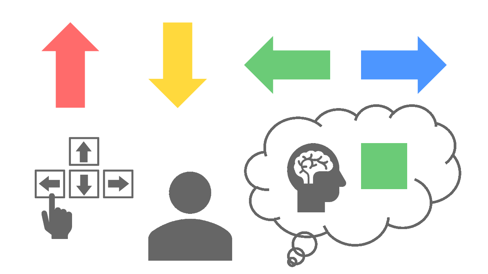
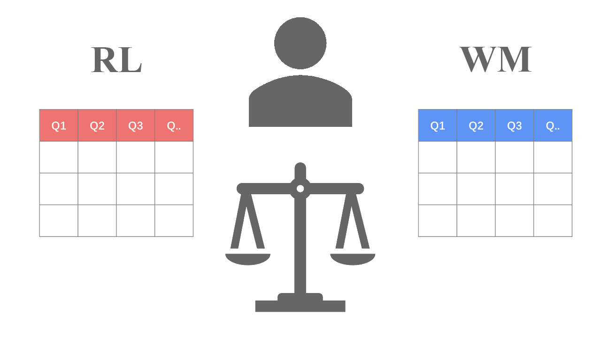
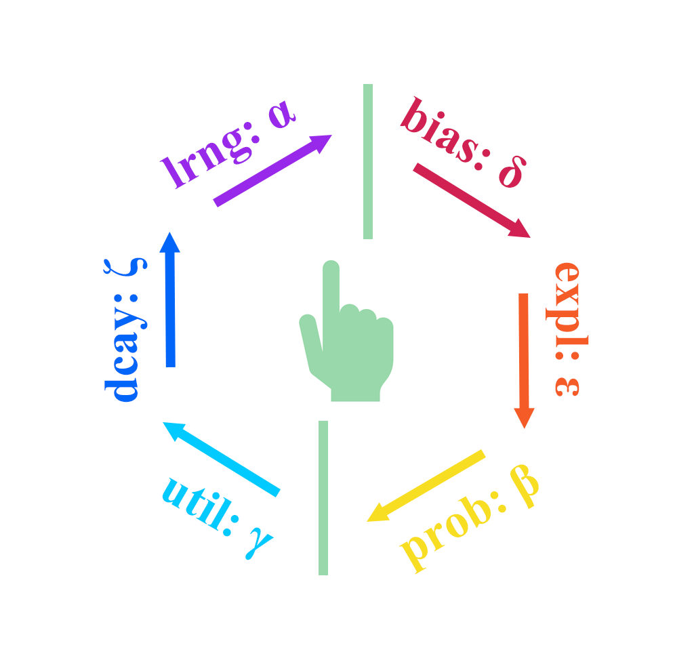

<a href="https://yuki-961004.github.io/multiRL/"></a>

<!-- badges: start -->
<a href="https://github.com/yuki-961004/multiRL/actions/workflows/R-CMD-check.yaml">
  
</a>
<a href="https://app.codecov.io/gh/yuki-961004/multiRL">
  
</a>
<a href="https://CRAN.R-project.org/package=multiRL">
  
</a>
<a href="https://CRAN.R-project.org/package=multiRL">
  
</a>
<!-- badges: end -->

## Overview

This package modularizes the **Markov Decision Process (MDP)** into **six** core components, enabling users to flexibly construct the **Rescorla-Wagner Model** for **Multi-Armed Bandit** tasks (see Sutton & Barto, [2018](https://mitpress.mit.edu/9780262039246/reinforcement-learning/)). Beginners can define models using simple **`if-else`** logic, making model construction more accessible (built-in three basic models, see Niv et al., [2012](https://doi.org/10.1523/JNEUROSCI.5498-10.2012)).  

* [Step 1](https://yuki-961004.github.io/multiRL/articles/multiRL.html#id_1-run-model): Build Reinforcement Learning Models `run_m()`
* [Step 2](https://yuki-961004.github.io/multiRL/articles/multiRL.html#id_2-recovery): Parameter and Model Recovery `rcv_d()`
* [Step 3](https://yuki-961004.github.io/multiRL/articles/multiRL.html#id_3-fit-real-data): Fit Real Data `fit_p()`
* [Step 4](https://yuki-961004.github.io/multiRL/articles/multiRL.html#id_4-replay-the-experiment): Replay the Experiment `rpl_e()`

These four steps follow the ten simple rules for the computational modeling of behavioral data (Wilson & Collins [2019](https://doi.org/10.7554/eLife.49547))

<!---------------------------------------------------------->

## Installation

```r
# Install the stable version from CRAN  
install.packages("multiRL")
# Install the latest version from GitHub
remotes::install_github("yuki-961004/multiRL@*release")

# Load package
library(multiRL)
# Obtain help document
?multiRL
```

### Multiple Choices  

Obviously, this package supports multi-choice tasks. In addition, we do not know what humans treat as the target when they encounter a particular state and update their values, especially when the **cue** and the **response** are not the same. In such cases, the agent typically needs to learn latent rules. 

<p align="center">
    
</p>

```r
behrule = list(
  cue = c("Red", "Yellow", "Green", "Blue"),
  rsp = c("Up", "Down", "Left", "Right")
)
```

### Multiple Systems

When humans make decisions, multiple cognitive processing systems may be involved (e.g., RL, WM, ...). Each cognitive system may update its own Q-value representation, and these multiple Q-value estimates are then combined with different weights to influence the final choice.

<p align="center">
    
</p>

```r
system = c("RL", "WM", "...")
```

### Multiple Modules  

<p align="center">
    
</p>

```r
# learning-rate function
lrng_func = multiRL::func_alpha
```
$$
  Q_{new} = Q_{old} + \alpha \cdot (R - Q_{old})  
$$
```r
# soft-max function  
prob_func = multiRL::func_beta
```
$$
  P_{t}(a) = 
    \frac{
      \exp\left( \beta \cdot \left( Q_t(a) - \max_{j} Q_t(a_j) \right) \right)
    }{
      \sum_{i=1}^{k} \exp\left(
        \beta \cdot \left( Q_t(a_i) - \max_{j} Q_t(a_j) \right) \right
      )
    }
$$
```r
# utility function
util_func = multiRL::func_gamma
```
$$
  U(R) = {R}^{\gamma}
$$
```r
# bias function (upper-confidence-bound, sticky, ...)
bias_func = multiRL::func_delta
```
$$
  \text{Bias} = \delta \cdot \sqrt{\frac{\log(N + e)}{N + 10^{-10}}}
$$
```r
# exploration function (ε-first, ε-greedy, ε-decrasing)  
expl_func = multiRL::func_epsilon
```
$$
  P(x) = 
    \begin{cases}
      \epsilon, & x=1  \\
      1-\epsilon, & x=0 
    \end{cases}
$$
```r
# decay function (working memory)
dcay_func = multiRL::func_zeta
```
$$
  W_{new} = W_{old} + \zeta \cdot (W_{0} - W_{old})
$$

### Multiple Estimators

| Category | Method | Supported Options |
| :--- | :--- | :--- |
| **LBI** Likelihood Based Inference | **MLE** Maximum Likelihood Estimation | [8 Optimization Algorithms](https://yuki-961004.github.io/multiRL/reference/algorithm.html) |
| | **MAP** Maximum A Posteriori (EM-MAP) | [8 Optimization Algorithms](https://yuki-961004.github.io/multiRL/reference/algorithm.html) |
| **SBI** Simulation Based Inference | **ABC** Approximate Bayesian Computation | [2 Dimension Reduction](https://yuki-961004.github.io/multiRL/reference/reduction.html) |
| | **RNN** Recurrent Neural Network | [3 Layers & 6 Loss Functions](https://yuki-961004.github.io/multiRL/reference/layer.html) |


## Reference  

- Sutton, R. S., & Barto, A. G. (2018). *Reinforcement Learning: An Introduction* (2nd ed). MIT press.  
- Wilson, R. C., & Collins, A. G. (2019). Ten simple rules for the computational modeling of behavioral data. *Elife, 8*, e49547. https://doi.org/10.7554/eLife.49547  
- Niv, Y., Edlund, J. A., Dayan, P., & O'Doherty, J. P. (2012). Neural prediction errors reveal a risk-sensitive reinforcement-learning process in the human brain. *Journal of Neuroscience, 32*(2), 551-562. https://doi.org/10.1523/JNEUROSCI.5498-10.2012  
- Collins, A. G., & Frank, M. J. (2012). How much of reinforcement learning is working memory, not reinforcement learning? A behavioral, computational, and neurogenetic analysis. European Journal of Neuroscience, 35(7), 1024-1035. https://doi.org/10.1111/j.1460-9568.2011.07980.x  
- Eckstein, M. K., & Collins, A. G. (2020). Computational evidence for hierarchically structured reinforcement learning in humans. Proceedings of the National Academy of Sciences, 117(47), 29381-29389. https://doi.org/10.1073/pnas.1912330117  