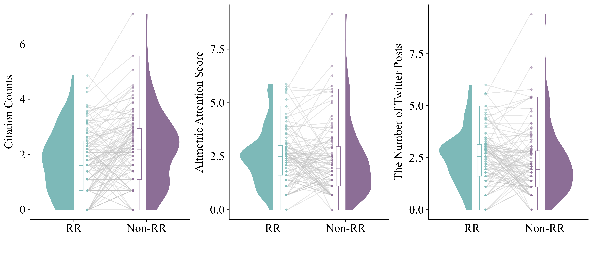
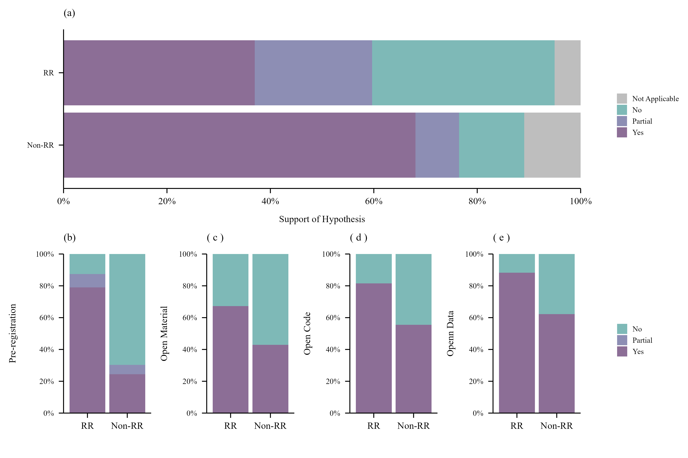
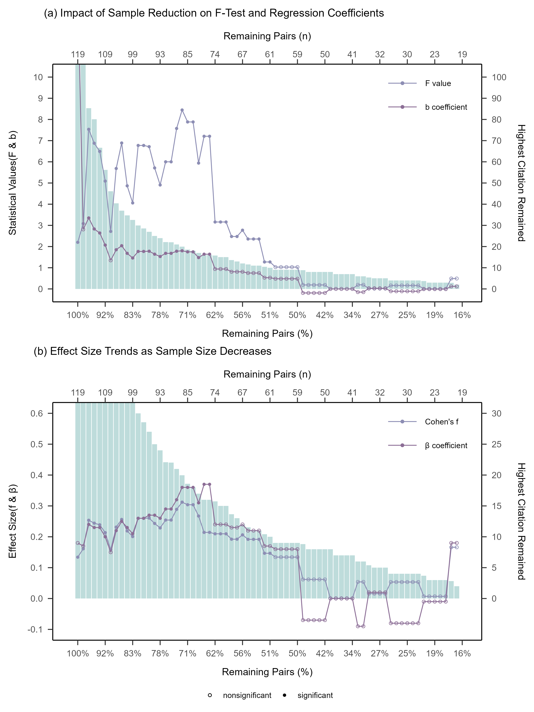

Registered Reports (RRs) represent a novel publishing format designed to enhance transparency and mitigate publication bias by conducting peer review before research outcomes are known. This meta-research identified 119 pairs of original research articles matched by journal, publication time, and research topic using keyword matching to compare their scholarly citations and public dissemination. Unfortunately, despite being viewed as a more rigorous publication model, RRs in psychology did not attract significantly higher attention; in fact, they were found to receive fewer scholarly citations than traditional non-registered reports.

In terms of scientific rigor, RRs demonstrated a clear advantage by significantly reducing the bias against null results, reporting positive findings at a rate of 62.83% compared to the much higher 85.84% found in traditional reports. Furthermore, transparency practices—including preregistration and the sharing of open data, code, and materials—were notably more prevalent in RRs than in their matched non-RR counterparts. However, this improved transparency and methodological quality did not translate into higher impact metrics, as RRs received lower citation counts when controlling for publication days, and overall public impact on social media remained statistically similar to traditional papers.

Because citation data is characterized by extreme positive skewness, we performed a detailed sensitivity analysis to ensure the findings were not driven by outliers. We systematically tested the stability of the results by removing different proportions of the most-cited articles and rerunning their analysis. This robustness check revealed that the finding of lower citation counts for RRs remained statistically significant unless more than 37% of the regression data or 50% of the F-test data were excluded, confirming that the citation disadvantage is a robust phenomenon within the studied sample.

