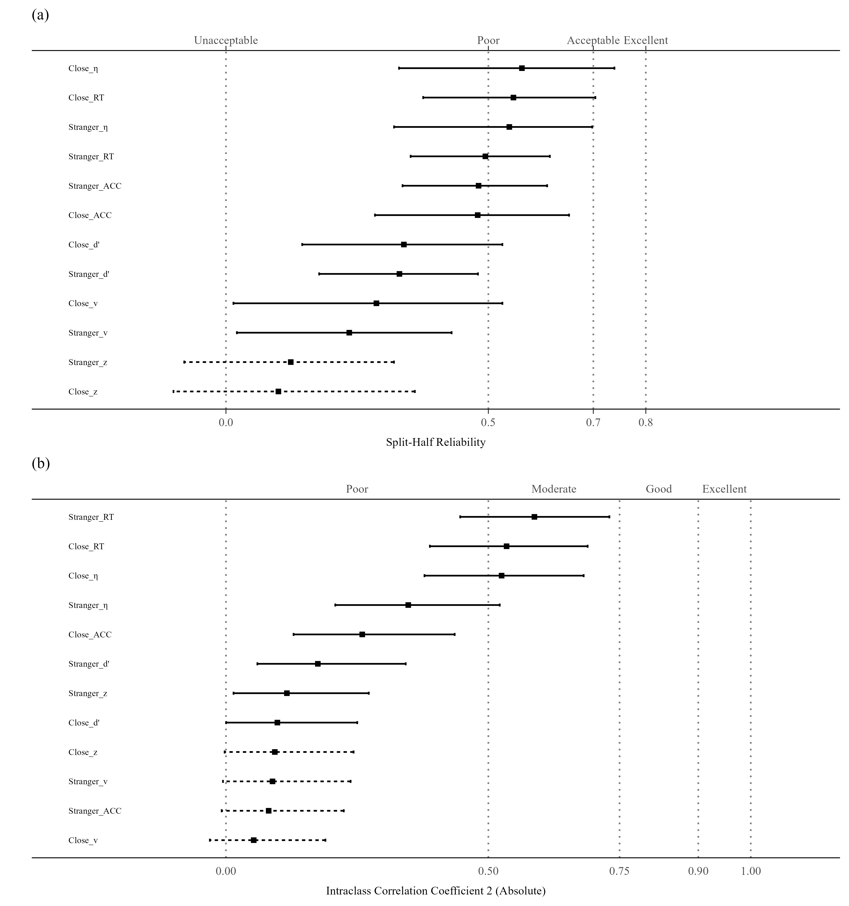
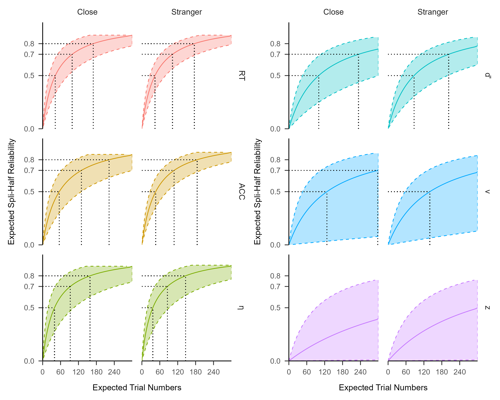
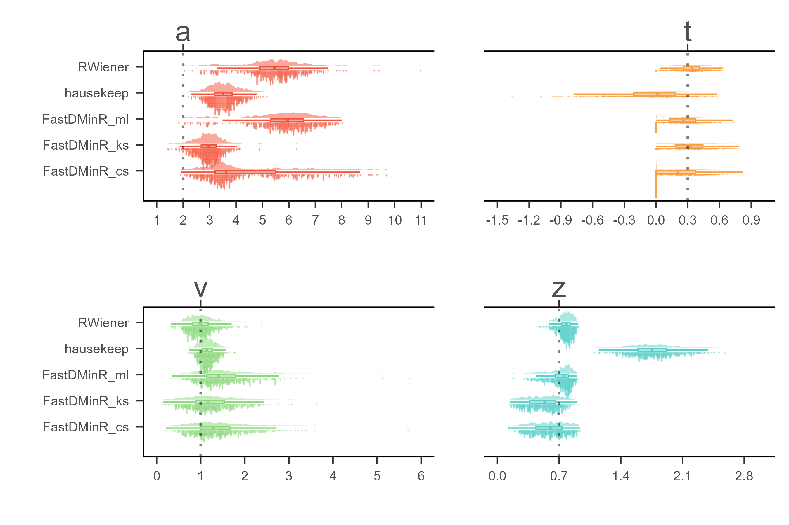

The self-matching task (SMT) has become a widely adopted paradigm for investigating the self-prioritization effect (SPE), consistently demonstrating a robust processing advantage for self-associated stimuli. We conducted a meta-analysis on 42 openly available datasets that used this paradigm ($N = 2250$). The results showed that the paradigm produces highly stable experimental effects: participants responded faster and more accurately to self-related stimuli than to non-self-related stimuli.

However, as predicted by the reliability paradox, this paradigm also showed relatively poor reliability at the individual level. This issue was especially pronounced for the drift-diffusion model (DDM) parameters drift rate ($v$) and starting point ($z$). Among all examined metrics, reaction time (RT) and efficiency ($RT/ACC$) showed comparatively higher reliability, although their coefficients were still only around 0.6.

Since the number of trials varied substantially across studies, we used the Spearman–Brown prediction formula to estimate how many trials would be needed to reach a commonly accepted reliability level of $0.8$. The results showed that RT would require roughly $170$ trials to achieve this target, whereas the other measures would require substantially more trials. The DDM-related parameters, in particular, showed especially poor reliability. Notably, the starting point parameter ($z$) was consistently close to zero across datasets, suggesting that the standard DDM may not be well suited for this paradigm.

In addition, to identify the most effective computational tools for this paradigm, we performed parameter recovery tests on simulated data. We observed significant discrepancies in recovery accuracy among various R packages. After comparing five different algorithms, we determined that the `RWiener` provided the most favorable balance of accuracy and computational efficiency, outperforming other R packages.

