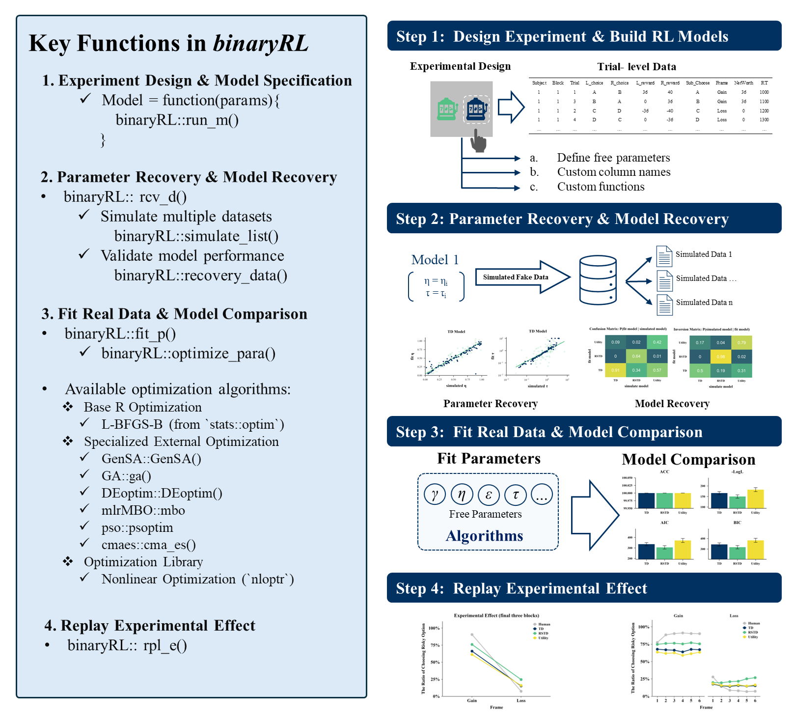

`binaryRL` was developed to make it easier for general psychology researchers to apply reinforcement learning models to their own experimental paradigms. By utilizing familiar `if-else` logic to define custom cognitive processes, users can bypass the steep learning curve traditionally associated with coding reinforcement learning from scratch. The entire modeling workflow is streamlined into four key functions: `run_m()` for core model execution, `rcv_d()` for parameter and model recovery, `fit_p()` for fitting real data, and `rpl_e()` for replaying experimental effects, which are built upon the foundational four-step framework (Wilson & Collins, [2019](https://doi.org/10.7554/eLife.49547)) for computational modeling. (For users who do not want to build models from scratch, the package also includes three built-in canonical reinforcement learning models described by Niv et al. [(2012)](https://doi.org/10.1523/JNEUROSCI.5498-10.2012).)

 

Although this workflow is already well established, in practice researchers often rebuild MDPs based on their own interpretations and coding styles. This process is not only time-consuming, but also creates challenges for reproducibility. Different researchers may use different programming languages, optimization algorithms, and implementation details, making results from the same model difficult to compare across studies. Another important goal of the `binaryRL` package is therefore to provide a more standardized framework for reinforcement learning research in psychology.

    

